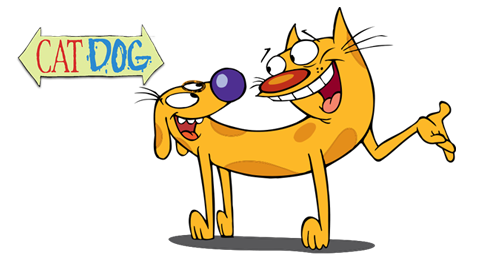

# CatDog


a fun little Rails app to predict whether a person prefers dogs or cats based on their height and weight

* [Dependencies](#dependencies)

* [Installation](#installation)

* [Test Suite](#testing)

* [Deployment](#deployment)

## <a name="dependencies"></a> Dependencies

* ```Ruby 2.3.1```

* ```Rails 5.0.0.1```

## <a name="installation"></a> Installing CatDog
To **install** the app:

```bash
# Clone down the necessary files:
git clone https://github.com/existenzial/CatDog.git

# Navigate to the newly cloned directory:
cd CatDog

# Install the dependencies
bundle install
```
## <a name="testing"></a>Running the Test Suite
To **run** the tests:
```bash
# Home Controller:
ruby -I. test/controllers/home_controller_test.rb

# People Controller:
ruby -I. test/controllers/people_controller_test.rb

# Person Model:
ruby -I. test/models/person_test.rb
```

## <a name="deployment"></a>Running the App Locally
To **run** the app:

```bash
# Start the server:
rails server

# Navigate to:
http://localhost:3000/
```